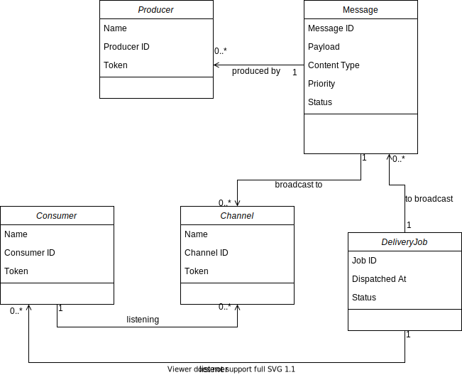

# Tech Spec: A Reliable Webhook Broker

|  |  |
| -- | -- |
| *Version* | 1 |
| *By* | Imran M Yousuf |
| *Date* | November 10, 2020 |

## Problem Statement / Goal

In a service oriented or microservice architecture the necessity to reliably pass messages between systems is essential. We want a reliable message broker without increasing architectural complexity with high throughput and scalability.

## Assumptions & Considerations

The assumptions into this tech spec are -

* All the consumers have an HTTP based interface available
* The interface or data model of webhook payload is agreed upon between producer and consumer
* The consumer will take care of out of order message being pushed

The considerations are -

* The broker will ensure at least once webhook event is delivered
* Consumer should have access to all the messages it failed to receive due to error on its part
* Consumer could access past messages for replaying purpose

Key attributes deliberately out of consideration -

* There will be no guarantee of message order
* There is no consideration for Consumer errors caused by bugs

## Use cases

The obvious goal is to serve the purpose of Enterprise Service Bus over HTTP; it is best suited when ordering is not a necessity; for example, change streams with optimistic locking. This Broker is not intended to be used as a replacement for Kafka or AWS Kinesis when order sequence is absolutely necessary.

### Yet another message broker

The key complexity that brokers such as SQS, AMQP based broker, Celery, Kinesis, Kafka is it needs a separate worker process that needs to be deployed in addition to your Web API. On the surface it might seem not so significant; but when we think about infrastructure code for deploying Web API **and** the worker; plus it also means we need to add 2 different kind of monitoring, logging, scalability and fail-over code to solve; and depending on volume the separate infrastructure may not make sense either. With auto-scalable infrastructure, I would argue that, most projects can do with the workers being HTTP to begin with.

Furthermore, from a developer perspective it simplifies what the developer works on; from a mental model you can concentrate of developing everything be HTTP endpoints, hence giving you the simplicity of following the same pattern.

Moreover, it is not polling based and with HTTP/2 multiplexing it makes it lucrative to have workers be based of HTTP where the broker pushes rather than the client pulls.

### Additional Possibilities

* Using Python Decorators and controlled controllers (specific to FastAPI and Flask) we can use this broker to implement Celery like message processor
* We can create a similar library wrapper imitating [Bull](https://github.com/OptimalBits/bull) using this broker as backend
* Using message priority we can have large back ground scripts generate a lot of event which will not hamper user action generating events from application

## Key Concepts

| Concept | Definition |
| -- | -- |
| Channel | A channel is the broadcast highway for messages. |
| Producer | Producer is the system generating a message and broadcasting it to a channel |
| Consumer | Consumer is the system registering itself to listen to messages broadcasted to a specific channel |
| DLQ / Dead Letter Queue | A queue (collection) of messages that failed deliver to the consumer for non 2XX response from client |
| Message | The payload Producer wants distributed across the Consumer within a Channel |
| Message Delivery | Reaching the consumer with the message should be considered as delivery, in case of success it would be marked as consumed, else end up in dead letter queue |
| Message Status | Message has 2 status - Acknowledged and Out-for-delivery |
| Message Delivery Status | Message Delivery status is associated with a Message, Channel and Consumer combination and is a enumeration of - In-flight, Retry-Delivery, Retry-In-flight, Delivered, Dead |
| Rational-delay | Time delta for fail-safe mechanism to kick in |
| Delivery-Timeout | How long will we wait for message delivery to finish before we step in |

## Life-cycle of a Message

### High-level Flow

* Broker receives a **Message** addressed to a **Channel** from a **Producer**
* Broker retrieves the **Consumers** interested in broadcast of a **Channel**
* Broker _delivers_ **Message** to each **Consumer** retrieved in previous step

### Key milestones in that flow

* Acknowledge to **Producer** of receipt of **Message**
* Track _delivery status_ of the **Message** against each **Consumer**

### Non-trivial scenarios

* Broker crashed before sending the acknowledgement
* Broker crashed after sending the acknowledgement but before attempting to deliver the messages
* Broker crashed attempting to deliver to some/all consumers but succeeded with others (if any)

### Design considerations

Based on the flow, non-trivial scenarios we want to derive at the following design considerations -

* Acknowledgement should be tied to being able to store Message **and** sending the ACK signal, but not dependent on Producer received the ACK signal.
* There should be a fail-safe way to ensure Acknowledged messages are attempted to deliver in case synchronous triggering of delivery process fails
* Consumer may not be available, so we should have a retry policy

### One level deeper

So based on the above conversation lets elaborate the high-level flow to more concrete blocks and dive deep in them. The building blocks would be -

1. Receive Message
1. Start Delivery Process
1. Attempt Individual Delivery

Lets look into each of them.

#### Receive Message

* Start Transaction
* Store Message
* Commit Transaction
* Send ACK
* Trigger Delivery Process

The acknowledgement transmission is intentionally not part of the transaction, as there is little bearing on the Producer actually receiving it. The worst case scenario will be Producer will resend the message.

#### Start Delivery Process

There is 2 entry points to the process.

##### Triggered By Receipt Message

* Retrieve the message
* Retrieve the consumers
* Start transaction
* Create delivery status for each consumer
* Mark message out-for-delivery
* Commit transaction
* Trigger independent asynchronous delivery process

##### Triggered Fail-safe message

* Retrieve all messages older than rational-delay
* For each message use the Receipt Message trigger flow

#### Attempt Individual Delivery

For each message delivery we would have to follow the delivery lifecycle as designated by the _Message Delivery Status_. Here too, there will be 2 triggering functions -

* Triggered by fail-safe mechanism
  * Retrieve message deliveries in _Retry-Delivery_ with _next attempt timestamp_ past rational-delay
  * For each message delivery run the _Triggered by Start Delivery Process_ process
* Triggered by Start Delivery Process
  * Update message delivery status to _Retry-In-Flight_ if the status is _Retry-Delivery_
  * For delivery message retrieve consumer
  * Attempt to deliver message
  * Wait for the period of Delivery-Timeout
    * If timed out then update status as _Retry-Delivery_ with exponentially backed off _next attempt timestamp_
  * If work finishes before Timeout, mark status as _Delivered_
  * If consumer failed to connect, update status as _Retry-Delivery_ with exponentially backed off _next attempt timestamp_
  * If Max-Retries is reached and status is not _Delivered_ then mark delivery as _Dead_

### Prioritized Dispatcher

We can now overlay an aspect of _priority_ on this dispatcher process as well. For example, if there is a relatively higher priority message for a Consumer in a Channel, then in most cases that should be delivered first; one effect of introducing priority is, it will deliberately disrupt the order even further. Priority will allow producers to dictate in relative sense which should be delivered earlier provided they are both enqueued for delivery; it could very well be the cause that a relatively low and high priority message can be attempted to deliver concurrently. As the fail-safe mechanism will use the same process as the regular, it should respect priority if that is chosen. One important consideration would be, when priority is switched on, it will definitely impact overall throughput since there will be an active attempt to order queued messages by priority.

## Implementation Consideration

### Language Choice

Instead of focusing on "_Why not \<language\>?_", I would rather like to point out the key advantages of the language choice. The choice of language for the project is GoLang; the primary reasons for the choice are -

* GoLang's CSP inspired [concurrency](https://golang.org/doc/effective_go.html#concurrency) model
* GoLang's single binary based deployment model simplifies deployment and maintenance
* [Event Loop is built into](https://www.quora.com/What-is-the-difference-between-Python-asyncio-and-Golang-Go-routines) Go's DB drivers and HTTP Clients making it suitable for such use
* Implicit [interface](https://golang.org/doc/effective_go.html#interfaces) and [build time IoC](https://github.com/google/wire) will be handy in storage independent implementation
* Performance. [GetStream.io](https://getstream.io/), who has a broader amount of use cases similar to this project already did [deep study](https://getstream.io/blog/switched-python-go/#:~:text=Go%20is%20extremely%20fast.,game%20comparing%20Go%20vs%20Python.) on it.
* Concurrency at scale. [Malwarebyte's experience](http://marcio.io/2015/07/handling-1-million-requests-per-minute-with-golang/) inspired us to write our own experiment code around it with priority queue baked in

### Storage Choice

Storage would be the most obvious bottleneck in scaling throughput for an application such as this. But I firmly believe too much concern of such cases is premature optimization and it would be nice to have this headache. So we will go for simplicity - MySQL 8. Primarily because if push comes to shove we will be able to choose [MySQL Group Replication](https://dev.mysql.com/doc/refman/8.0/en/group-replication.html) with [multi-primary mode enabled](https://dev.mysql.com/doc/refman/8.0/en/group-replication-multi-primary-mode.html); this functionality is also available through [managed services](https://docs.aws.amazon.com/AmazonRDS/latest/AuroraUserGuide/aurora-multi-master.html#aurora-multi-master-overview). The implementation will be abstracted sufficiently we can totally switch to a NoSQL such as Kafka, Cassandra for scaling writes. For unit tests we will be using SQLite. Furthermore, GoLang's [MySQL driver](https://github.com/go-sql-driver/mysql) is matured from some [extensive production use](https://github.blog/2020-05-20-three-bugs-in-the-go-mysql-driver/) as well.

### Prioritized Message Limitations

Taking priority into consideration automatically will have throughput implications since enqueueing and dequeueing will have to be mutually exclusive across the queue. And trying to maintain the queue across the cluster of broker would add more complication. So we will limit the priority to take effect within a single instance of the broker process. What it means is when we have a worker available to dispatch a message it will always give priority to the highest priority message. It also means, if there are too many messages queued, the likely time needed to queue will be longer; so increasing brokers aggressively is a deployment recommendation.

### HTTP2 Consideration

Given throughput is one of the primary goal of the project, HTTP/2 had to be an avenue we explore to take advantage of its multiplexing capabilities and binary frame compression. The limitation would be what if a consumer is not HTTP/2 enabled or the producer's HTTP client is HTTP/1.1 compliant only; in most cases Go's HTTP server and client can talk in both protocols. One other consideration is, the load balancer used with the broker has to be HTTP/2 compliant in receiving and proxying; for example, until [very recently](https://aws.amazon.com/blogs/aws/new-application-load-balancer-support-for-end-to-end-http-2-and-grpc/) AWS ALB is HTTP/2 enabled in receiving but not when proxying. From an implementation standpoint we will have to account for the fact that now requests [will come more in batch](https://www.lucidchart.com/techblog/2019/04/10/why-turning-on-http2-was-a-mistake/) rather than sequential calls.

## Implementation Details

### Objects

### Endpoints

We want the broker service itself to be stateless and follow the RESTful API paradigms. As follows are the conventions for the API -

* `PUT` for creating **Producer**, **Channel** and **Consumer**; primarily to allow the client to dictate the ID; it will be idempotent so it can work as edit as well
* All `PUT` request will accept `application/x-www-form-urlencoded` MIME Type Form data
* All the `GET` will expose a `Last-Modified` header
* `DELETE` is not supported for any resource type
* All list endpoints will be ordered by ID and hence use ID as the pagination key
* When `PUT` requests will created it will return `201`; else `200` when updated.
* **Message** can only be a `POST` and can not be amended, but can be fetched.
  * The POST call will need to come with special headers to identify Producer
    * `X-Broker-Producer-ID` ID of the Producer
    * `X-Broker-Producer-Token` Token of the Producer
  * The POST call also will need the channel token for simple auth purpose - `X-Broker-Channel-Token`
  * The message priority will also need to be passed via header - `X-Broker-Message-Priority`
  * Message's content type will be derived from request `Content-Type`; if missing will default to `application/octet-stream`
* The **Message** list endpoint can be filtered using _statusChangedSince_ query parameter
* The **Message** `GET` endpoint will list all the jobs and their status in the resource itself since the **Message** and **DeliverJob** are both immutable through the API.
  * **DeliveryJob** will expose re-trigger endpoint to be used by consumer, but only if the delivery status is _dead_.
* **Message** delivery or **DeliveryJob** can be re-triggered using _Admin Token_ by the Fail-safe worker
  * That means they will have special re-trigger endpoint which will need _Admin Token_.
  * DLQ'd jobs can be re-triggered by consumer using its _Consumer Token_.
  * The Admin token is - `X-Broker-Admin-Token`
  * The delivery to a consumer will also contain `X-Broker-Consumer-Token` to ensure the request is coming from Broker, in addition to a custom `User-Agent`

So the endpoints available would be -

1. PUT /producer/{producer-id}
1. GET /producers (Query Params - size, first)
1. GET /producer/{producer-id}
1. PUT /channel/{channel-id}
1. GET /channels (Query Params - size, first)
1. GET /channel/{channel-id}
1. PUT /channel/{channel-id}/consumer/{consumer-id}
1. GET /channel/{channel-id}/consumers (Query Params - size, first)
1. GET /channel/{channel-id}/consumer/{consumer-id}
1. GET /channel/{channel-id}/consumer/{consumer-id}/dlq - The dead letter queue
1. POST /channel/{channel-id}/broadcast
1. GET /channel/{channel-id}/messages (Query Params - statusChangedSince, size, first)
1. GET /channel/{channel-id}/message/{message-id}
1. POST /channel/{channel-id}/message/{message-id}/re-trigger (fail-safe only)
1. POST /channel/{channel-id}/message/{message-id}/job/{job-id}/re-trigger (DLQ or fail-safe)

### Fail-safe worker

Whether the fail-safe worker is working, that will be a configuration; similarly the _Admin Token_ will also be a configuration. Fail-safe worker will simply re-trigger a state using Load-Balanced endpoint of the broker (that is call itself) so that rest of the process works as usual. The spinning up of fail-safe worker will be configurable so that fail-safe is executed from a single execution-unit.

### Libraries

* Schema Migration Management - [GoLang Migrate](https://github.com/golang-migrate/migrate)
* Web Controller Router - [Gorilla Mux](https://github.com/gorilla/mux) and [Gorilla Handlers](https://github.com/gorilla/handlers)
* Log Management & Rotation - [Lumberjack.V2](https://github.com/natefinch/lumberjack)
* Build Time IoC - [Google Wire](https://github.com/google/wire)
* Configuration parsing - [Go INI](https://github.com/go-ini/ini)
* ORM - to avoid reflection (and hence performance consequence) we will use the [sql package](https://golang.org/pkg/database/sql/) of Go which itself is quite easy to use and flexible.
* Unit Test - [Testify](https://github.com/stretchr/testify)

### Configuration Management Friendly

In order for making configuration management easy, we will allow Producer, Channel and Consumer to also be created directly through Configuration. Since the IDs will be known and the URIs for the resources predicted, they can be hooked up to any service discovery backend to fetch the `Token` values in runtime.

### Caching of key objects

To ensure key objects such as **Producer**, **Channel** and **Consumer** which are accessed quite frequently we will implement a simple read-through cache in non-distributed mode; the reason on read-through will suffice is, when updating the only field that can be updated in reality is the `Name` which will not be accessed for message delivery.

### CI & Release Management

We use Github Actions along with Makefile for continuous integration purpose. We will use Github Actions for release management purpose as well.

## Adoption Strategy

Given how primitive the APIs of the broker is, when creating Python and Node clients for the project we will need keep them as close (if possible identical) to Celery and SQS/Bull APIs (may 2 clients for Node) such that replacing the code is as minimal as changing the import statement in most trivial cases. For atypical cases, for example using Celery API to publish to Celery Broker (`app.send_task`), we will need a code change; but there too we can keep the code comparable.

## Key Open Question

### To be decided during implementation

* Should we make it mandatory for **Producer** to associate a Message ID? It could be used to ensure that we do not resend a Message in case the Producer crashed before receiving the ACK. Or should we make it optional to keep the flexibility?
* Should there be a Signature of the Message passed in header for data integrity verification? Or should we make it optional to keep the flexibility?
* What is the rational-delay for fail-safe process to pick up Message and Message Delivery? Going with a minute could be too late in certain circumstance.
* What is a reasonable delivery-timeout?
* What is a reasonable Max-Retry limit?

### To be addressed by separate techspec

* Do we need rate limiting per Consumer-Channel combo?
* Do we want to have control over pausing pushing to Consumer?
* Can we automate a protocol for DLQ processing from the broker?
