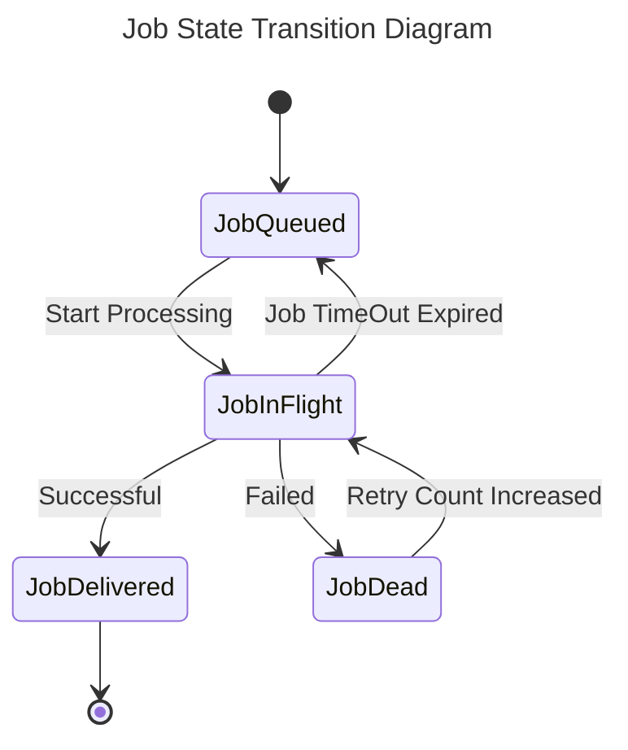

# Tech Spec: Adding Pull Consumer Support

|               |                         |
| ------------- | ----------------------- |
| _Version_     | 1                       |
| _By_          | Bishwajit Bhattacharjee |
| _Date_        | February 5, 2023        |
| _Last Update_ | March 27, 2023          |

## Problem Statement / Goal

In certain scenarios, pull-based consumers may prove to be more advantageous than push-based ones. As such, we seek to implement a system that offers consumers the option to register themselves as either pull or push-based. This system provides several benefits, such as allowing consumers to rate-limit or throttle event consumption as per their discretion.

## Use cases

While push-based consumers are generally preferred in most cases, they may not be ideal for events that require long processing times. To address this issue with push consumer, there are two potential solutions:

Firstly, we could process the event and subsequently reply to the broker. However, this approach may prove problematic for long-running events, as the broker's timeout may occur before the processing completes. Alternatively, we could reply to the webhook-broker immediately with a success response and process the event in the background. However, this method may lead to overwhelming the consumer with events, as the webhook-broker continues to send new requests.

We can solve this problem with pull based consumers. With the support of Pull mechanism, a consumer can also rate-limit or throttle the consumption of events.

## High-level Flow

1. Each consumer will have a [_type_](https://github.com/newscred/webhook-broker/blob/main/storage/data/consumer.go#L45) field with values **push** or **pull**. Default value of _type_ would be **push** i.e: by default the consumers will be **push** based.
   There are two ways to update the _type_ field:

   - Through initial config file

     We can add _type=pull_ or _type=push_ [here](https://github.com/newscred/webhook-broker/blob/main/webhook-broker.cfg.template#L76) depending on our desired consumer Type. If _type_ is not specified or kept empty like _type=_, push type consumer is assumed for backward compatibility. If any other invalid type is specified, that seed consumer won't be created.

   - Through the consumer PUT endpoint `/channel/:channelId/consumer/:consumerId`

     This endpoint now takes an optional form field named _type_. Values are limited to _push_ and _pull_. If type is not provided or kept empty, it will create a push type consumer by default.

1. We need to stop the [enqueueing](https://github.com/newscred/webhook-broker/blob/main/dispatcher/msgdispatcher.go#L100) of the jobs for the pull consumers. Instead, we will just mark the jobs _JobQueued_ and open an [endpoint](https://github.com/newscred/webhook-broker/blob/main/controllers/job.go#L82) for the consumer to get the pending jobs that are in [_JobQueued_](https://github.com/newscred/webhook-broker/blob/main/storage/data/job.go#L13) status. This endpoint has to be paginated.
1. Consumers will be given the responsibility to change the status of the jobs through an http [endpoint](https://github.com/newscred/webhook-broker/blob/main/controllers/job.go#L180). Allowed state transitions are:

   - _JobQueued_ -> _JobInFlight_
   - _JobInFlight_ -> _JobDelivered_ (if successful)
   - _JobInFlight_ -> _JobDead_ (if failure)
   - _JobDead_ -> _JobInFlight_ (with retry count increased)

   The default timeout for a job is calculated as the sum of `stopTimeout` and `rationalDelay`, expressed in seconds. If a consumer is unable to complete the job within this time limit, the broker will requeue the job for retrying. However, different pull jobs may have varying timeout requirements, and therefore, a pull consumer can specify a different timeout value when moving a job from the _JobQueued_ or _JobDead_ status to _JobInflight_ status using the endpoint.

   To specify a custom timeout, when a pull consumer moves a job from _JobQueued_/_JobDead_ to _JobInflight_ through the endpoint, it can optionally pass a field `IncrementalTimeout` in seconds. In that case, if the job is not complete within $stopTimeout + rationalDelay + incrementalTimeout$ seconds, the broker will assume that the consumer failed while executing the job and requeue the job for retrying later with increasing the retry count by one. The job will be dead if it is retried more than maximum allowed retry count. A job's status can also be _JobDead_ if the consumer, while processing the job, decides it cannot process any furthur.



## Newly Added Endpoints

We need to add two new endpoints for supporting the pull consumers -

1. GET url: `/channel/{channel-id}/consumer/{consumer-id}/queued-jobs?limit=25`

   The endpoint requires the `X-Broker-Channel-Token` and `X-Broker-Consumer-Token` headers

   The response structure is:

   ```javascript
   {
      Result: [
         {
               ID: string,
               Priority: integer,
               Message: {
                  MessageID: string,
                  Payload: string,
                  ContentType: string,
               },
         },
         ...
      ]
   }
   ```

   `Result` holds all the jobs with status _JobQueued_ for a specific consumer for a specific channel. The jobs are sorted in descending order of message priority.
   The value of `limit` will default to `25`. The maximum value is `100`. A higher value will get clipped to `100`.

1. POST url: `/channel/{channel-id}/consumer/{consumer-id}/job/{job-id}`
   Changes the status of the job according to the state machine. Allowed state transitions are:

   - _JobQueued_ -> _JobInFlight_
   - _JobInFlight_ -> _JobDelivered_
   - _JobInFlight_ -> _JobDead_
   - _JobDead_ -> _JobInFlight_

   The desired state should be passed in data. Allowed NextState values are: `INFLIGHT`, `DELIVERED`, `DEAD`. Along with _NextState_, there would be an optional field named `IncrementalTimeout` which sets the timeout for this job. This field is only valid when the _NextState_ is `INFLIGHT` and actual state of this job in database is not `INFLIGHT`. In all other cases, the endpoint will get a `400 Bad Request` response.

   If the current job status and requested next job status are the same, a `202 Accepted` response will be given with no DB change. All other transitions are invalid and will get a `400 Bad Request` response.

   The consumer should pass both the `X-Broker-Channel-Token` and `X-Broker-Consumer-Token` in the request header to verify its identity.

   The following is an example of valid request for a job whose current state is `INFLIGHT`:

   ```javascript
   POST /channel/cfcvtt116477r2nkgvr0/consumer/cfcvtt116477r2nkgvqg/job/cfcvv0h16477r2nkh0rg
   Accept: application/json
   Content-Type: application/json
   X-Broker-Channel-Token: sample-channel-token
   X-Broker-Consumer-Token: sample-consumer-token
   Content-Length: 81

   {
      "NextState": "DELIVERED"/"DEAD",
   }
   ```

   The following payload is also valid and it will set a 10 second `IncrementalTimeout` along with the default timeout for the job:

   ```javascript
   {
      "NextState": "INFLIGHT",
      "IncrementalTimeout": 10
   }
   ```

   But the following is an invalid payload (It should not contain `IncrementalTimeout` field):

   ```javascript
   {
      "NextState": "DELIVERED"/"DEAD",
      "IncrementalTimeout": 10
   }
   ```
